# 4 黑乐谱MIDI制作：音符画部分

欢迎来到第四章，黑乐谱的音符画部分。笔者IMT11D并不精通音符画制作，甚至可以说对于高质量音符画的制作几乎是一窍不通。所以，我们接下来把舞台交给——黑乐谱末影君

大家好，我是笔者小末。

## 4.1 一千万以内最好的音符画画板

> 卧槽这么好的软件你咋不早点告诉我

> 我寻思你应该知道啊。。。

咳咳，说回来——

Domino在2026年（或者今天）确实属于老轱辘棒子这个范畴，并不能帮助你高效地创作音符画。相反，Domino做音符画的体验大概率是十分没意思且痛苦的，很多操作都必须手动进行，而且还会有卡顿问题（如果你的音符画密度太高的话）。

**这时候你需要换一个软件，有请Lumino登场！**

Lumino是一款用Rust编写的，面向超大型黑乐谱的新一代MIDI编辑器，由PenguinBMDevs开发，以AGPL-3.0许可开源，仓库地址是<https://github.com/PenguinBMDevs/lumino-rs>。它的官方定位是“A Fast Black MIDI Editor”，即面向黑乐谱与超大型工程的快速编辑器。

它的技术栈值得一提：窗口用winit，界面用iced，渲染用wgpu走GPU加速，音频合成以内置的XSynth为核心。这样的组合带来了两个直接的好处。

第一是跨平台，Windows、macOS与Linux都能原生运行；Windows上还额外支持KDMAPI与系统MIDI输出，可以直接接到你熟悉的波表上（比如OmniMIDI），其他平台则使用内置的XSynth加载SoundFont发声。第二是性能，软件的音符存储、渲染管线与内存监控都是围绕超大工程设计的，GPU渲染配合增量上传，让千万级音符工程下的滚动、缩放和编辑依然可用。这一点在处理面积巨大、音符密集的音符画时尤其重要。

而且Lumino并不只是一个“音符画生成器”，它同时也是功能完整的MIDI编辑器：多轨编辑、CC控制器、弯音与速度曲线等自动化编辑一应俱全，量化、变速、翻转、分割、合并、移调、连奏等批量工具也都齐备。工程可以保存为.lmpj文件或文件夹，可以导入MIDI（甚至直接导入压缩包里打包的MIDI）再导出MIDI，还能导出音频与视频，支持多人协作以及FTP/SFTP/WebDAV云存储。换句话说，你完全可以把Domino做好的音频部分导进来，在Lumino里完成音符画，再导回去或直接出片，两者的分工是互补而非替代。

使用内置XSynth时需要自备SoundFont音色库；Windows用户可以继续沿用OmniMIDI等波表，其他平台则依赖内置合成器。项目完全开源，构建脚本与文档都在仓库里，喜欢折腾的读者可以自行编译最新版本。

对音符画而言，Lumino的价值在于把过去分散在Image2Midi、FL Studio、Domino与各类渲染器之间的流程，收拢进了一个软件：图片、文字、图形、笔画、素材、预览、导出，都在同一个工程内完成。希望它能成为各位Blacker手中又一把趁手的工具，也期待大家用它做出更精彩的作品。

> 需要坦诚提醒的是，Lumino目前仍处于开发阶段，功能与界面都还在快速演进，遇到问题或有功能建议，欢迎直接到GitHub仓库提Issue。

> 以及上面这段不是我写的是11D写的awa

### 4.1.1 快速上手Lumino

在讲音符画之前捏我们先来稍稍了解一下下这个可爱滴小企鹅（qi↓o↑）

> ~~嗯可以看到嗯我们的小企鹅（qi↓o↑）也是十分的肥美啊嗯。。。~~

#### 4.1.1.1 下载Lumino

> 哇这肥美的企鹅给我看美了我好想用awa
>
> 等会Lumino在啥地方下啊不是

Step1：动动你聪明的小手手打开你的浏览器

Step2：打开链接（好人给我们点点小星星行不行qwq）

https://github.com/PenguinBMDevs/lumino-rs

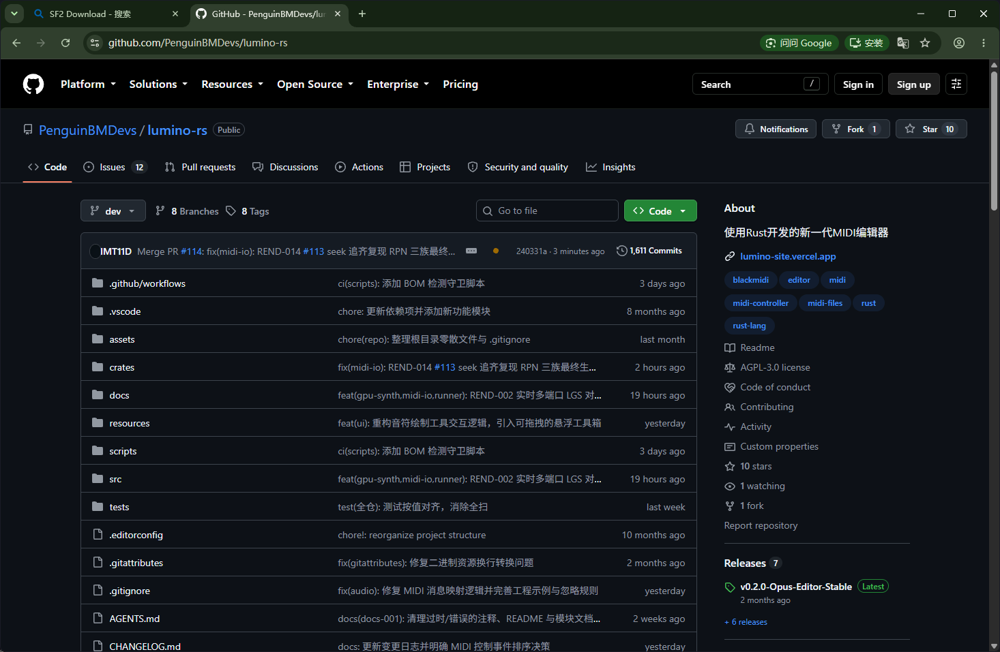

Step3：打开Release界面，找到最新版本（本文以v0.2.0为例）

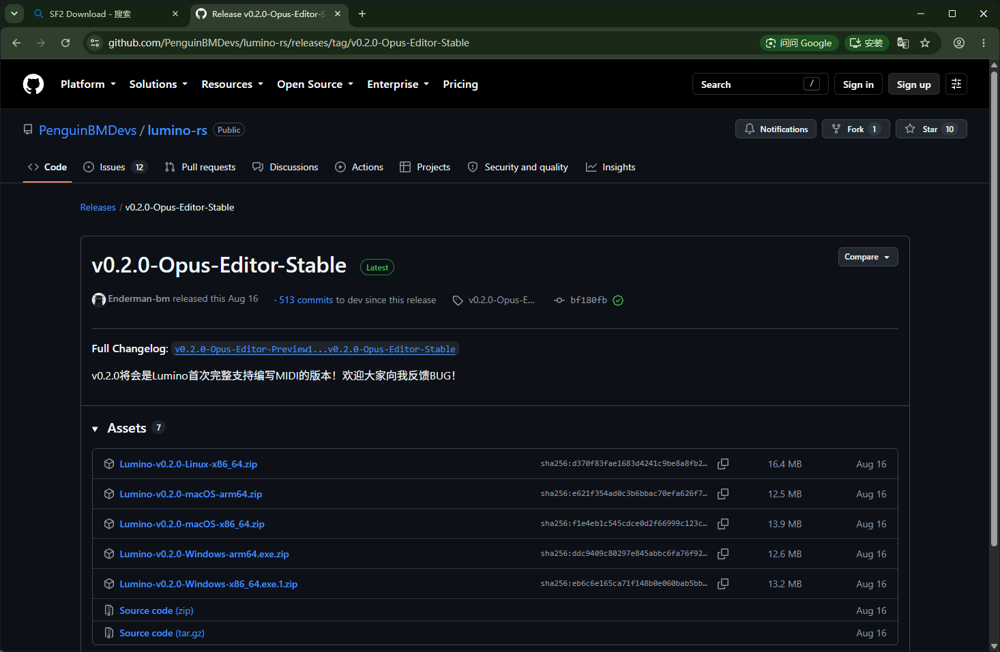

Step4：选择适合你平台的程序，点击下载

> 大部分宝子的机器应该是Windows x64的，选择图中指示的点击下载即可

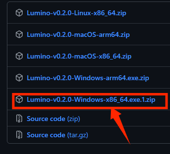

**重要提示！！！**

**Lumino只支持Windows 10 1607以上的版本！！不支持且永远不会支持也永远没法支持低于本版本的Windows系统！！**

Step5：打开压缩包，解压程序到你喜欢的位置

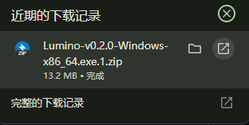

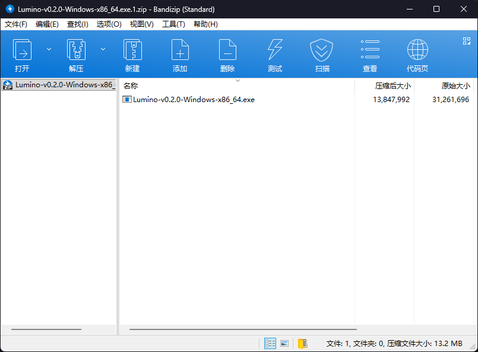

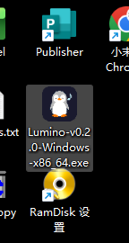

当你看到这只白白嫩嫩的小企鹅（qi↓o↑）之后，恭喜你成功地安装了Lumino！

#### 4.1.1.2 配置你的音频引擎！

Lumino为广大用户提供了非常多的音频引擎接入方案（见下表）。

| 编号 | 名称                               |
| ---- | ---------------------------------- |
| 1    | XSynth                             |
| 2    | LGS（实验性GPU播放引擎，性能一般） |
| 3    | KDMAPI（OmniMIDI接口）             |
| 4    | WinMM（系统播表）                  |

> tips：如果你是Linux/macOS，那你可能只能使用前两个输出。因为OmniMIDI不支持其他系统，WinMM概念也不存在于其他系统中

> 我们默认推荐大家使用内置的XSynth（也许将来会换成更好的）。

咱都知道，这音频输出他是没音色库没法出声，所以下面——配置音色库，走起！

Lumino推荐使用SF2格式的音色，所以本教程以SF2音色为例

动动你灵活的手指，找到你的浏览器并且打开

> 刚刚不是打开了嘛？
>
> 那你就别开了啊接着用啊

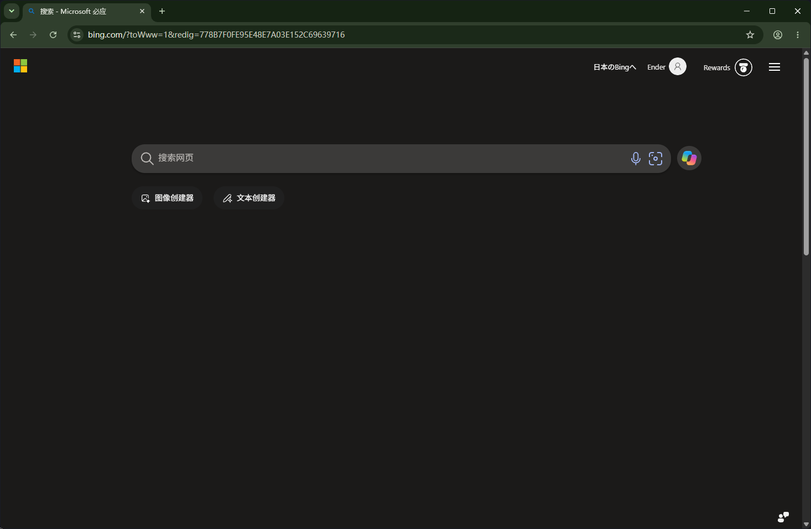

在搜索框中输入"SF2 Download"

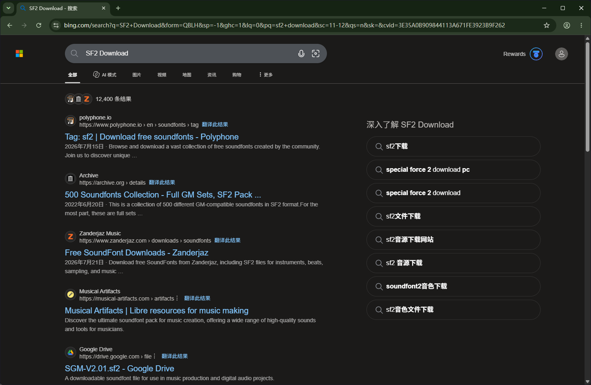

在任意网站中查找任意SF2并且下载

等待下载完成后，找到你下载的SF2文件（这里以Aqua_s_JV-2080为例），并且记住他的位置

双击打开Lumino，你大概率会看到这个神秘的小窗口

> 看起来好危险，我不能让他运行！
>
> 那你还用Lumino吗qwq

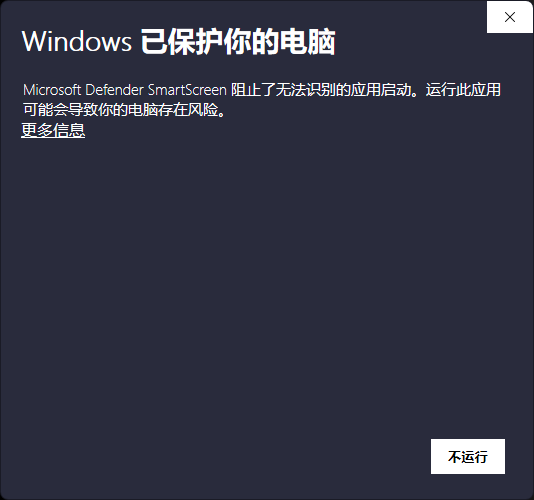

点击更多信息，展开隐藏的小按钮，点击运行

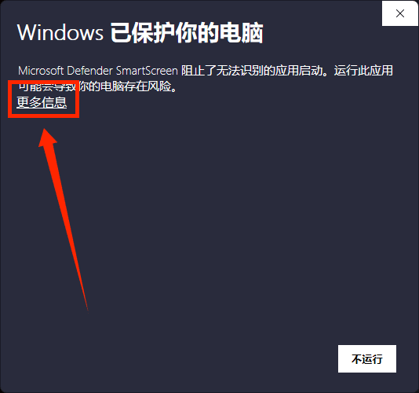

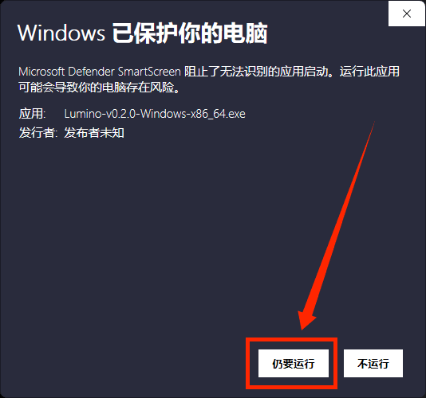

在网络界面选择：允许

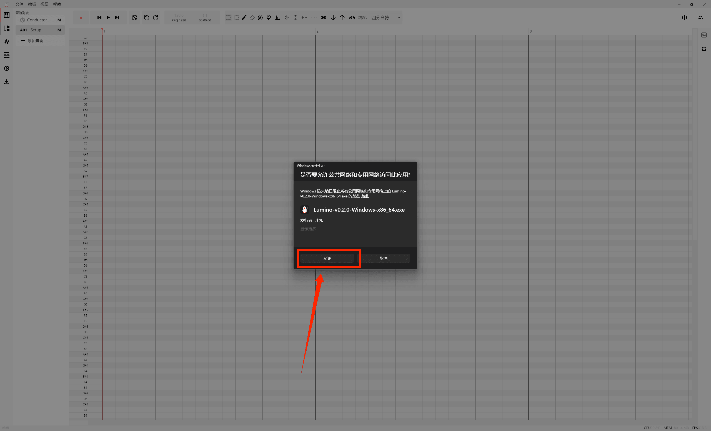

这时，你将会看到一个超级大的白色编辑器界面

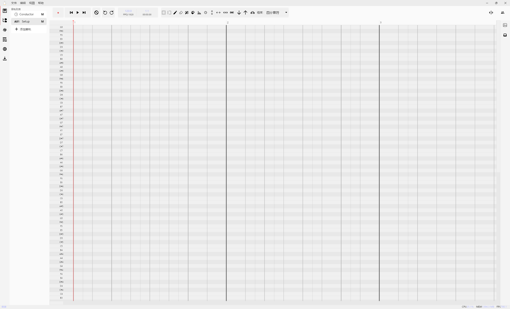

找到上方的顶部标题栏，打开“文件”菜单

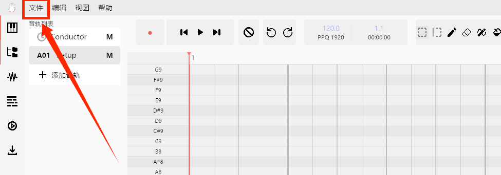

打开下拉菜单，找到“设置”

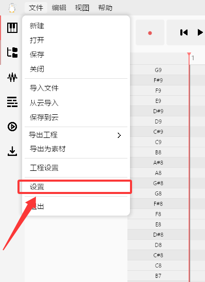

点击并且打开设置面板

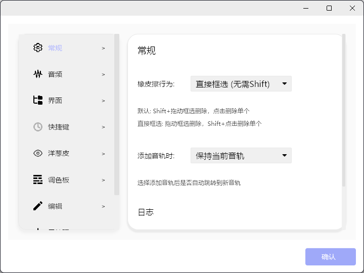

转到音频选项卡

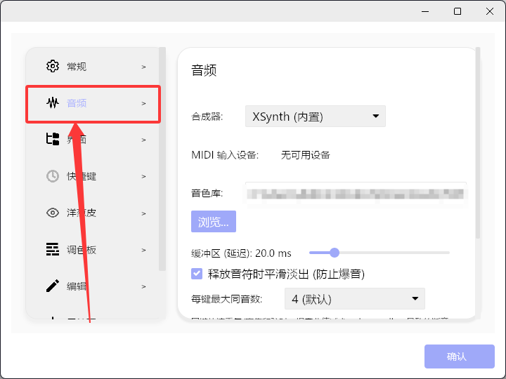

找到“音色库”下方的“预览”按钮并且点击

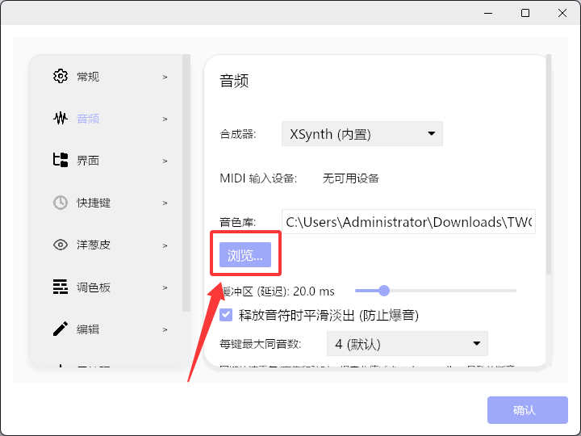

在弹出的文件管理器中，找到你刚才下载的SF2文件，选中并且点击打开（当然双击也行）

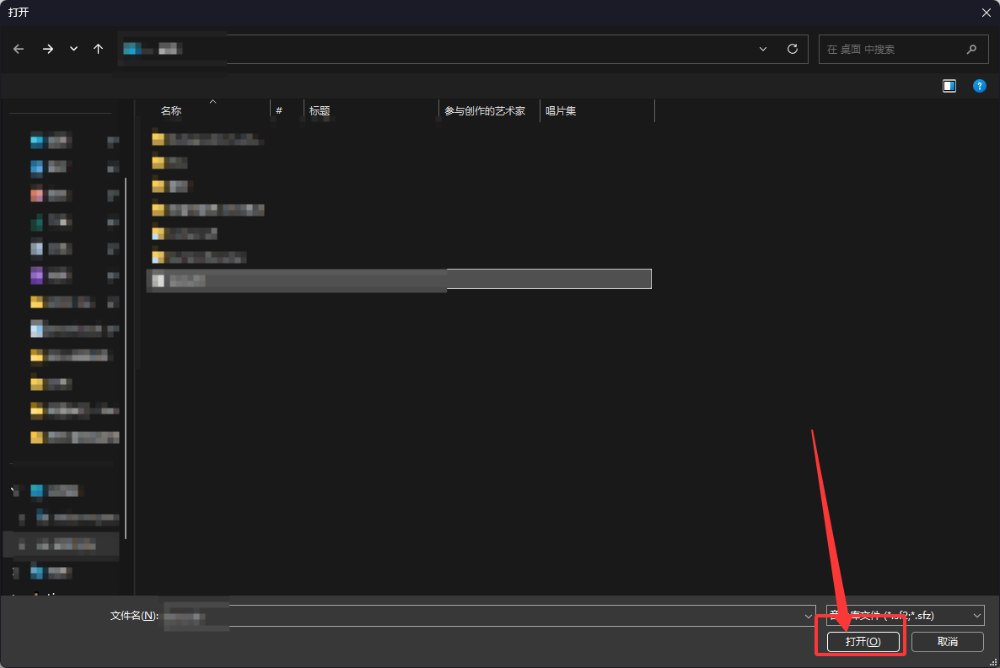

检查标记处的路径是否变更。检查完毕后按下“确认”按钮

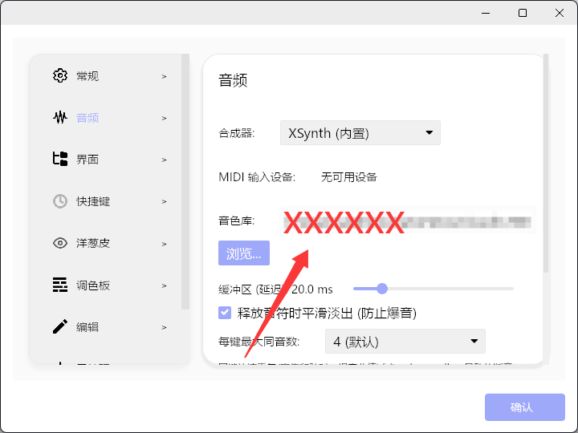

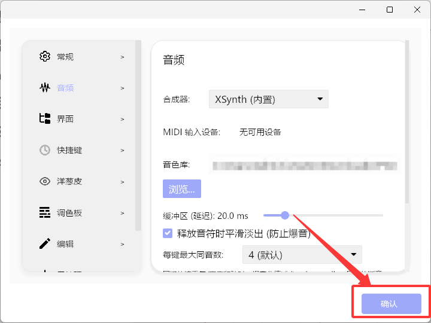

恭喜你！你成功配置了你的音色库！

### 4.1.2 规划

（待补充）

### 4.1.3 规划中

（待补充）

### 4.1.4 规划中

（待补充）

### 4.1.5 规划中

（待补充）

## 4.2 规划中

### 4.2.1 规划中

### 4.2.2 规划中

### 4.2.3 规划中

### 4.2.4 规划中

## 4.3 规划中

### 4.3.1 规划中

### 4.3.2 规划中

### 4.3.3 规划中

### 4.3.4 规划中

### 4.3.5 规划中
